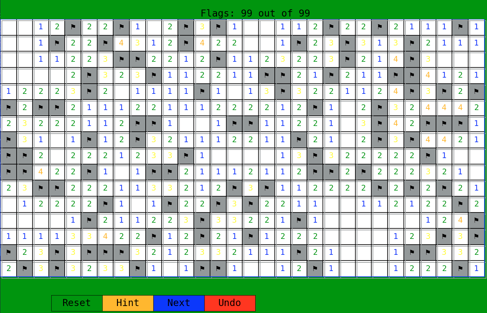
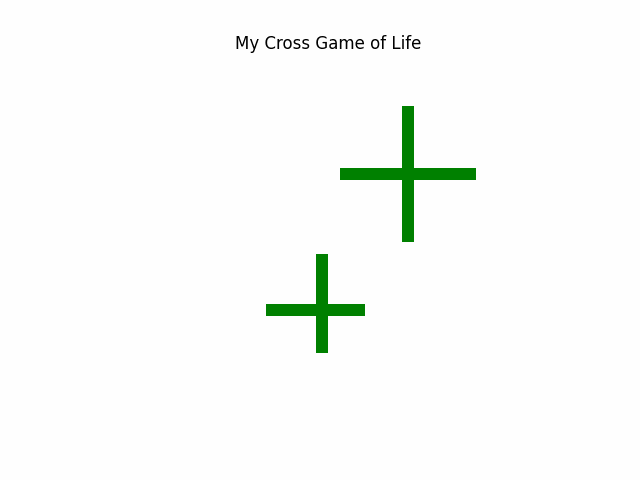
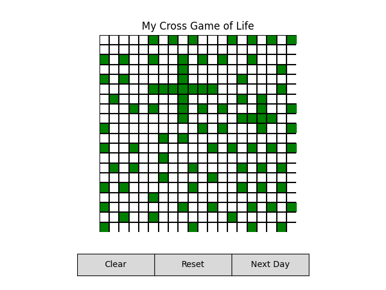
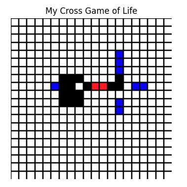
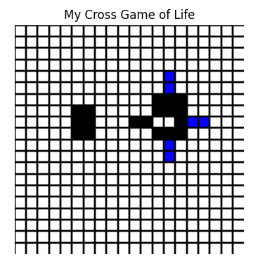

# CrossFinder and Minesweeper Solver - Custom Game of Life Variants

This repository contains two distinct Python Projects,Combining Cellular Automata with Game Development. The projects are as follows:

1. **CrossFinder**: An innovative variant of Conway's Game of Life, meticulously engineered to detect and manipulate cross shapes within a grid environment. Diverging from the conventional Game of Life, CrossFinder integrates additional states and tailor-made rules aimed at pinpointing and transforming cross-shaped patterns.

2. **Minesweeper**: A Python implementation of the classic Minesweeper game with a graphical user interface (GUI) using `Matplotlib` and `NumPy`. This project includes additional features like reset, hint, next, and undo buttons.

Both projects utilize basic Python libraries such as `NumPy` and `Matplotlib`, and are designed to run in a local environment. Enjoy exploring these projects and feel free to contribute to their development!

## Table of Contents

<!-- @import "[TOC]" {cmd="toc" depthFrom=2 depthTo=3 orderedList=false} -->

<!-- code_chunk_output -->

- [Table of Contents](#table-of-contents)
- [Minesweeper](#minesweeper)
  - [Minesweeper Features](#minesweeper-features)
  - [Installation](#installation)
  - [Usage](#usage)
  - [Gameplay Instructions](#gameplay-instructions)
  - [Contributing](#contributing)
  - [Acknowledgements](#acknowledgements)
- [CrossFinder](#crossfinder)
  - [Finder Features](#finder-features)
  - [How the CrossFinder Works](#how-the-crossfinder-works)
  - [How to Run the CrossFinder](#how-to-run-the-crossfinder)
  - [CrossFinder GUI](#crossfinder-gui)
  - [Runing Examples](#runing-examples)
- [License](#license)

<!-- /code_chunk_output -->

---

## Minesweeper

A Python implementation of the classic Minesweeper game with a graphical user interface (GUI) using Matplotlib and NumPy. This project includes additional features like reset, hint, next, and undo buttons.

<p align="center">
  
</p>

### Minesweeper Features

- **Classic Minesweeper Gameplay**: Inspired by the original Minesweeper game from Microsoft Windows.
- **Graphical User Interface (GUI)**: Built with Matplotlib for visual interaction.
- **Interactive Buttons**:
  - **Reset Button**: Resets the game.
  - **Hint Button**: Reveals a random hidden cell.
  - **Next Button**: Applies a custom rule set inspired by Conway's Game of Life to reveal hidden cells.
  - **Undo Button**: Undoes the last move.
- **Custom Rules**: Implements custom rules for the "Next" button to provide an enhanced gameplay experience.
- **Game Over and Win Conditions**: Game ends when a mine is hit or all non-mine cells are revealed.

### Installation

1. **Clone the repository**:

   ```bash
   git clone https://github.com/Dor-sketch/CrossFinder
   cd CrossFinder
    ```

2. **Install the required packages**:

   ```bash
   pip install -r requirements.txt
    ```

### Usage

1. **Run the Minesweeper game**:

    ```bash
    python3 mines.py
    ```

2. **Play the game using the GUI**:

    - Left-click to reveal a cell.
    - Right-click to flag a cell as a mine.

### Gameplay Instructions

- **Objective**: Reveal all non-mine cells without hitting a mine.
- **Cells**:
  - Hidden Cell: A cell that has not been revealed.
  - Revealed Cell: A cell that has been revealed, showing either a number or a mine.
  - Flagged Cell: A cell flagged as a potential mine.
- **Buttons**:
  - Reset: Starts a new game.
  - Hint: Reveals a random hidden cell.
  - Next: Applies custom rules to reveal hidden cells.
  - Undo: Reverts the last move.

### Contributing

Contributions are welcome! Please open an issue or submit a pull request with any improvements or bug fixes.

Here are some ways you can contribute:

- **Add new features to the game**: e.g., timer, high scores, custom grid sizes. Create a new game mode or difficulty level.

- **GUI enhacements**: Implement additional buttons or functionalities to enhance the gameplay experience. Modified `matplotlib` default toolbar to include additional buttons for game controls.

- **Algorithm improvements**: Optimize the game logic or implement new rules for revealing cells.

### Acknowledgements

- Inspired by the classic Minesweeper game from Microsoft Windows.

- Built using [Matplotlib](https://matplotlib.org/) and [NumPy](https://numpy.org/).

---

## CrossFinder

CrossFinder is an innovative variant of Conway's Game of Life, meticulously engineered to detect and manipulate cross shapes within a grid environment. Diverging from the conventional Game of Life, CrossFinder integrates additional states and tailor-made rules aimed at pinpointing and transforming cross-shaped patterns.

This ingenious program was conceived as a response to problem 28 in the seminal book **Biological Computation** by Ehud Lamm and Ron Unger. It was developed as a key component of the "Biological Computation" course at the Open University of Israel. The solution, amalgamated with another program ([simulationEarth](https://github.com/Dor-sketch/SimulationEarth)), was submitted and acclaimed with a perfect score of 100.

<p align="center">
  
    <p align="center">
        <i>Algorithm identify target '+' shape</i>
    </p>

---

### Finder Features

- Grid-based simulation where each cell can be in one of four states:
  - `0`: Dead
  - `1`: Alive
  - `2`: Red, marking cells that are part of a cross or interact with cross shapes
  - `3`: Blue, indicating the propagation of a wave from the edges of a cross towards its center
- Custom rules to detect and highlight cross shapes within the grid
- Functionality to visualize the detection and processing of crosses in real-time

### How the CrossFinder Works

<p align="center">
  
    <p align="center">
        <i>Visualization of the CrossFinder simulation waves</i>
    </p>
</p>

The CrossFinder program operates on a grid where cells can transition between states based on their neighbors. The primary focus is on identifying and marking cross shapes. A cross is defined as a vertical and horizontal line intersecting at a central cell, all of which are alive (`1`). When a cross is detected, the cells constituting the cross transition to the state `2` (red), signifying the first wave of detection.

#### Rules Overview

- The first wave (`2` state) targets cells that form the cross structure. When a pattern matching a part of the cross is found, those cells transition to the red state.
- The second wave (`3` state) begins at the edges of the cross and moves towards the center, marking the progression of the detection process.

### How to Run the CrossFinder

The program was tested on python `3.11` and requires the following packages:

- `numpy`: For grid manipulation and operations

- `matplotlib`: For visualization

---

Use the following command to run the program:

```bash
    python3 cross_game.py
```

If more than one python version is installed, try use the following command:

```bash
    python3.11 cross_game.py
```

---

### CrossFinder GUI

The program support both randomized initial states (press `reset` button) and user interactive controls (press the matrix cells to change their state).

For the next generation, press `next Day` button.

<p align="center">
  
</p>

### Runing Examples

#### Example 1

| Initial state | 2 | 3 | 4 | *Finale state* |
| - | - | - | - | - |
|  |  |  |  |  |

---

#### Example 2

Initial state - 2nd example: 2 valid crosses in different sizes

| Initial state | 2 | 3 | *Finale state* |
| - | - | - | - |
|  |  |  |  |

---

#### Example 3

Complex destruction exmp - no valid crosses

| 1 | 2 | 3 | 4 |
| - | - | - | - |
|  |  |  |  |

| 5 | 6 | 7 | 8 |
| - | - | - | - |
|  | |  |  |

|  10 | 11 | 12 | *Finale state* |
| - | - | - | - |
|  |  |  |  |

---

## License

This project is licensed under the MIT License - see the [LICENSE](./LICENSE) file for details.
