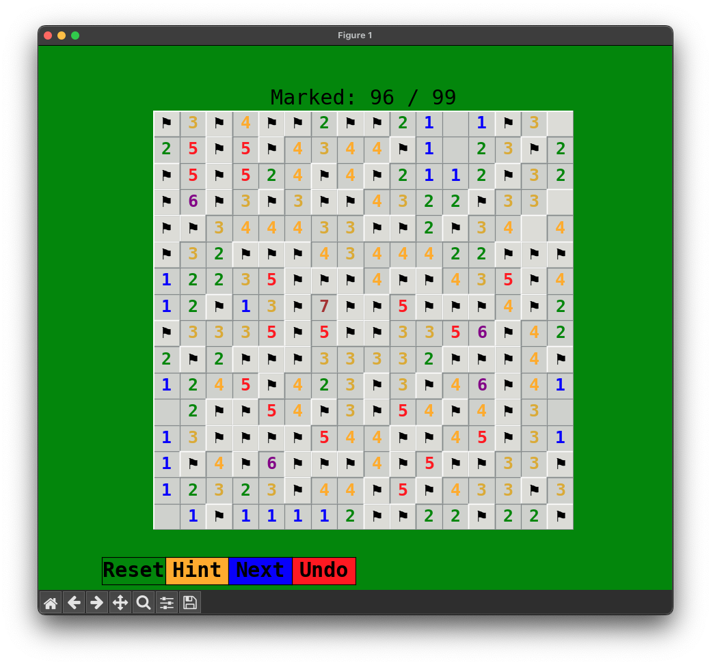
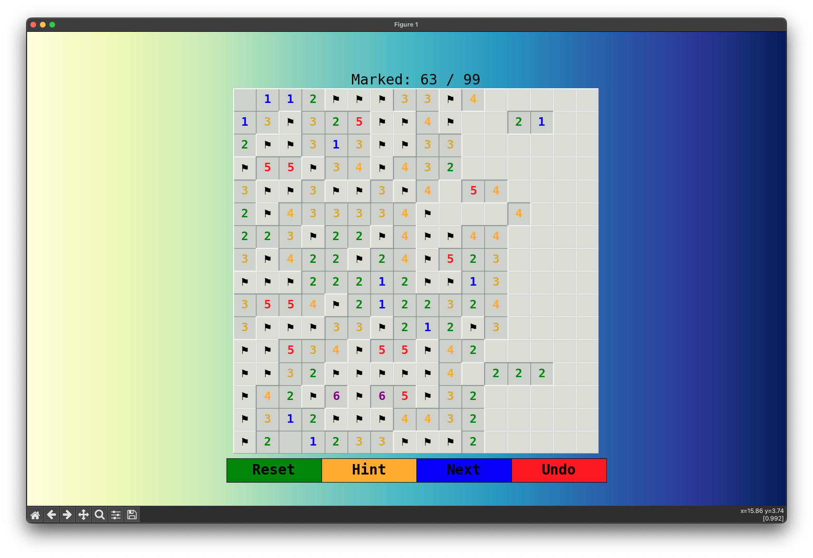
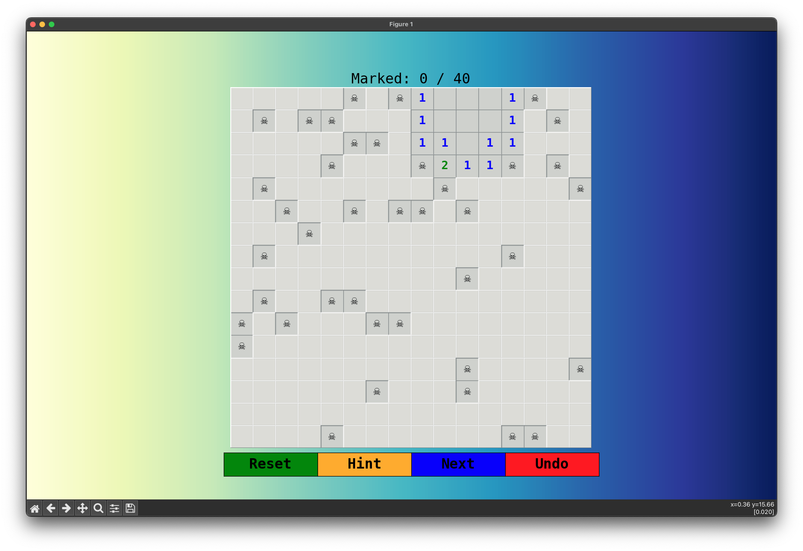
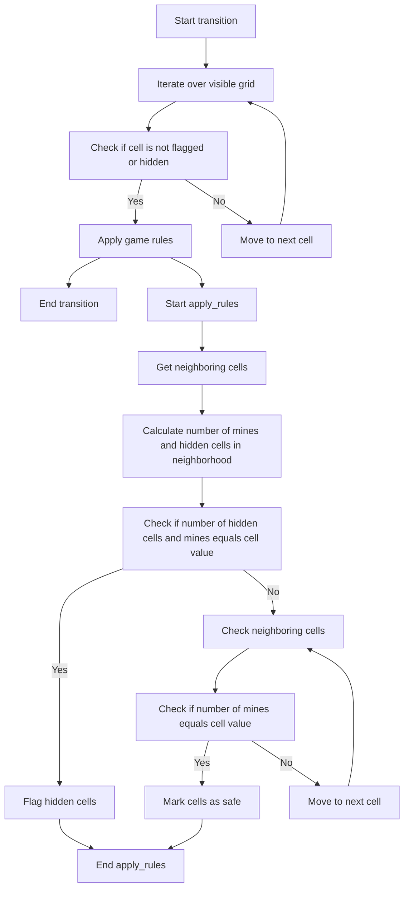

<div align="center">
  
  <h1>Exploring Game Algorithms:<br>CrossFinder and Minesweeper AI</h1>
</div>

---

This repository contains two distinct Python Projects, Combining Cellular Automata with Game Development. The projects are as follows:

1. **CrossFinder**: An innovative variant of Conway's Game of Life, meticulously engineered to detect and manipulate cross shapes. Diverging from the conventional Game of Life, CrossFinder integrates additional states and tailor-made rules aimed at pinpointing and transforming cross-shaped patterns.

2. **Minesweeper**: A Python implementation of the classic Minesweeper game with a graphical user interface (GUI) using `Matplotlib` and `NumPy`. This project includes additional features like reset, hint, next, and undo buttons.

> Both projects utilize basic Python libraries such as NumPy and Matplotlib, and were originally designed to run in a local environment.
>
> **Note**: The projects can now be run via the browser. For more information, please visit the [Git Pages for this repository.](https://Dor-sketch.github.io/CrossFinder)

[](https://github.com/Dor-sketch/CrossFinder/blob/main/LICENSE)
[](https://github.com/Dor-sketch/CrossFinder/issues)
[](https://github.com/Dor-sketch/CrossFinder/stargazers)
[](https://github.com/Dor-sketch/CrossFinder/network/members)

---

**Table of Contents**

<!-- @import "[TOC]" {cmd="toc" depthFrom=1 depthTo=6 orderedList=false} -->

<!-- code_chunk_output -->

- [Minesweeper](#minesweeper)
  - [Minesweeper Features](#minesweeper-features)
  - [Installation](#installation)
  - [Usage](#usage)
  - [Gameplay Demo](#gameplay-demo)
  - [Gameplay Instructions](#gameplay-instructions)
  - [How the Minesweeper Solver Works](#how-the-minesweeper-solver-works)
- [CrossFinder](#crossfinder)
  - [Finder Features](#finder-features)
  - [How the CrossFinder Works](#how-the-crossfinder-works)
    - [Rules Overview](#rules-overview)
  - [How to Run the CrossFinder](#how-to-run-the-crossfinder)
  - [CrossFinder GUI](#crossfinder-gui)
  - [Switching Modes](#switching-modes)
  - [Running Examples](#running-examples)
    - [Example 1](#example-1)
    - [Example 2](#example-2)
    - [Example 3](#example-3)
- [Contributing](#contributing)
- [Acknowledgements](#acknowledgements)
- [License](#license)

<!-- /code_chunk_output -->


---

## Minesweeper

A Python implementation of the classic Minesweeper game with a graphical user interface (GUI) using Matplotlib and NumPy. This project includes additional features like reset, hint, next, and undo buttons.

<p align="center">
  <i>Minesweeper Retro GUI with Dynamic Game Layout Support.</i>
  <br>
  
</p>

### Minesweeper Features

- **Classic Minesweeper Gameplay**: Inspired by the original Minesweeper game from Microsoft Windows.
- **Graphical User Interface (GUI)**: Built with Matplotlib for visual interaction.
- **Interactive Buttons**:
  - **Reset Button**: Resets the game.
  - **Hint Button**: Reveals a random hidden cell.
  - **Next Button**: Applies a custom rule set inspired by Conway's Game of Life to reveal hidden cells.
  - **Undo Button**: Undoes the last move.
- **Custom Rules**: Implements custom rules for the "Next" button to provide an enhanced gameplay experience.
- **Game Over and Win Conditions**: Game ends when a mine is hit or all non-mine cells are revealed.

### Installation

1. **Clone the repository**:

   ```bash
   git clone https://github.com/Dor-sketch/CrossFinder
   cd CrossFinder
    ```

2. **Install the required packages**:

    ```bash
    pip install -r requirements.txt
    ```

### Usage

1. **Run the Minesweeper game**:

    ```bash
    python3 mines.py
    ```

2. **Play the game using the GUI**:

    - Left-click to reveal a cell.
    - Right-click to flag a cell as a mine.

### Gameplay Demo

[Watch the video here](https://github.com/Dor-sketch/CrossFinder/assets/138825033/0b47e63a-9fa8-4b1f-b0a9-17ac5f92b7f7)

### Gameplay Instructions

- **Objective**: Reveal all non-mine cells without hitting a mine.
- **Cells**:
  - Hidden Cell: A cell that has not been revealed.
  - Revealed Cell: A cell that has been revealed, showing either a number or a mine.
  - Flagged Cell: A cell flagged as a potential mine.
- **Buttons**:
  - Reset: Starts a new game.
  - Hint: Reveals a random hidden cell.
  - Next: Applies custom rules to reveal hidden cells.
  - Undo: Reverts the last move.

<p align="center">
  <i>Skulls indicate mines in the game</i>
  <br>
  
</p>

### How the Minesweeper Solver Works

The states of each cell are reduced to three categories: hidden, flagged, or revealed. The solver iterates over the visible grid, applies game rules, and reveals cells based on the rules. The solver uses a custom rule set inspired by Conway's Game of Life to reveal hidden cells.



> **Note**: The solver might wont be proceed without revealing more cells that might be mines.

---

## CrossFinder

CrossFinder is an innovative variant of Conway's Game of Life, meticulously engineered to detect and manipulate cross shapes within a grid environment. Diverging from the conventional Game of Life, CrossFinder integrates additional states and tailor-made rules aimed at pinpointing and transforming cross-shaped patterns.

This ingenious program was conceived as a response to problem 28 in the seminal book **Biological Computation** by Ehud Lamm and Ron Unger. It was developed as a key component of the "Biological Computation" course at the Open University of Israel. The solution, amalgamated with another program ([simulationEarth](https://github.com/Dor-sketch/SimulationEarth)), was submitted and acclaimed with a perfect score of 100.

[Watch the video here](https://github.com/Dor-sketch/CrossFinder/assets/138825033/a8f0eb0a-88f0-44a2-ab0c-068b98fcabc6)

---

### Finder Features

- Grid-based simulation where each cell can be in one of four states:
  - `0`: Dead
  - `1`: Alive
  - `2`: Red, marking cells that are part of a cross or interact with cross shapes
  - `3`: Blue, indicating the propagation of a wave from the edges of a cross towards its center
- Custom rules to detect and highlight cross shapes within the grid
- Functionality to visualize the detection and processing of crosses in real-time

### How the CrossFinder Works

<p align="center">
  
  
    <p align="center">
        <i>Visualization of the CrossFinder simulation waves: Algorithm identify target '+' shape</i>
    </p>
</p>

The CrossFinder program operates on a grid where cells can transition between states based on their neighbors. The primary focus is on identifying and marking cross shapes. A cross is defined as a vertical and horizontal line intersecting at a central cell, all of which are alive (`1`). When a cross is detected, the cells constituting the cross transition to the state `2` (red), signifying the first wave of detection.

#### Rules Overview

- The first wave (`2` state) targets cells that form the cross structure. When a pattern matching a part of the cross is found, those cells transition to the red state.
- The second wave (`3` state) begins at the edges of the cross and moves towards the center, marking the progression of the detection process.

### How to Run the CrossFinder

The program was tested on python `3.11` and requires the following packages:

- `numpy`: For grid manipulation and operations
- `matplotlib`: For visualization

---

- Use the following command to run the program:

  ```bash
  python3 cross_game.py
  ```

- If more than one python version is installed, try use the following command:

  ```bash
  python3.11 cross_game.py
  ```

---

### CrossFinder GUI

The program support both randomized initial states (press `reset` button) and user interactive controls (press the matrix cells to change their state).

For the next generation, press `next Day` button.

### Switching Modes

Switch to conway's Game of Life from the CrossFinder and vise versa by simply clicking the `mode` button.

[Watch the video here](https://github.com/Dor-sketch/CrossFinder/assets/138825033/23cc4323-4521-4140-8180-df5e279c40da)

### Running Examples

#### Example 1

| Initial state | 2 | 3 | 4 | *Finale state* |
| - | - | - | - | - |
|  |  |  |  |  |

---

#### Example 2

Initial state - 2nd example: 2 valid crosses in different sizes

| Initial state | 2 | 3 | *Finale state* |
| - | - | - | - |
|  |  |  |  |

---

#### Example 3

Complex destruction example - no valid crosses

| 1 | 2 | 3 | 4 |
| - | - | - | - |
|  |  |  |  |

| 5 | 6 | 7 | 8 |
| - | - | - | - |
|  | |  |  |

|  10 | 11 | 12 | *Finale state* |
| - | - | - | - |
|  |  |  |  |

---

## Contributing

Contributions are welcome! Please open an issue or submit a pull request with any improvements or bug fixes.

Here are some ways you can contribute to the Minesweeper:

| Enhancement Category | Description | Status |
| --- | --- | --- |
| Add new features to the game | e.g., timer, high scores, custom grid sizes. Create a new game mode or difficulty level. | Not Started |
| GUI enhancements | Implement additional buttons or functionalities to enhance the gameplay experience. Modified `matplotlib` default toolbar to include additional buttons for game controls. | Not Started |
| Algorithm improvements | Optimize the game logic or implement new rules for revealing cells. | Not Started |
| Probabilistic solver | Develop a solver that uses probability to determine the best move. This is particularly useful in cases where no safe moves are available. This can be implemented using a Monte Carlo simulation or other probabilistic methods, such as Bayesian inference or Markov chains. | Not Started |
| Image recognition solver | Create a solver that uses image recognition techniques to analyze game boards as an input image and determine the best move. This can be implemented using computer vision libraries such as `OpenCV` or `TensorFlow`. | Not Started |

## Acknowledgements

- Inspired by the classic Minesweeper game from Microsoft Windows.
- Built using [Matplotlib](https://matplotlib.org/) and [NumPy](https://numpy.org/).

## License

This project is licensed under the MIT License - see the [LICENSE](./LICENSE) file for details.
